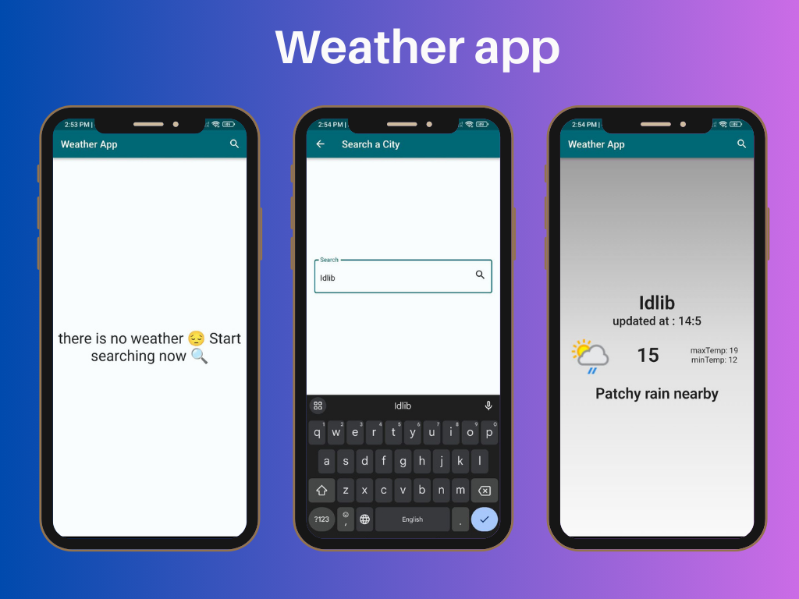

**# Preview:**
  

**# [Weather App] - Simple and Fast Weather Information**

**A simple weather application that provides you with basic information about the current weather anywhere in the world.**

**Main Features**

* **Current Weather Information:** Get a quick snapshot of the weather at your fingertips, including:
    * **Condition:** See if it's partly cloudy, sunny, rainy, or something else.
    * **Location:** Know exactly where the weather information is coming from (city or region name).
    * **Last Updated:** Stay informed with the most recent weather update time.
    * **Temperature:** Get the current temperature in degrees Celsius (additional units may be added in the future).
    * **Image:** Visualize the current weather conditions with a corresponding image.

**Benefits**

* **Easy to Use:** The intuitive design and straightforward interface make finding the weather information you need a breeze.
* **Fast Access:** Get quick and accurate current weather updates without any unnecessary delays.
* **Lightweight App:** Enjoy a small app size that won't take up much space on your phone.
